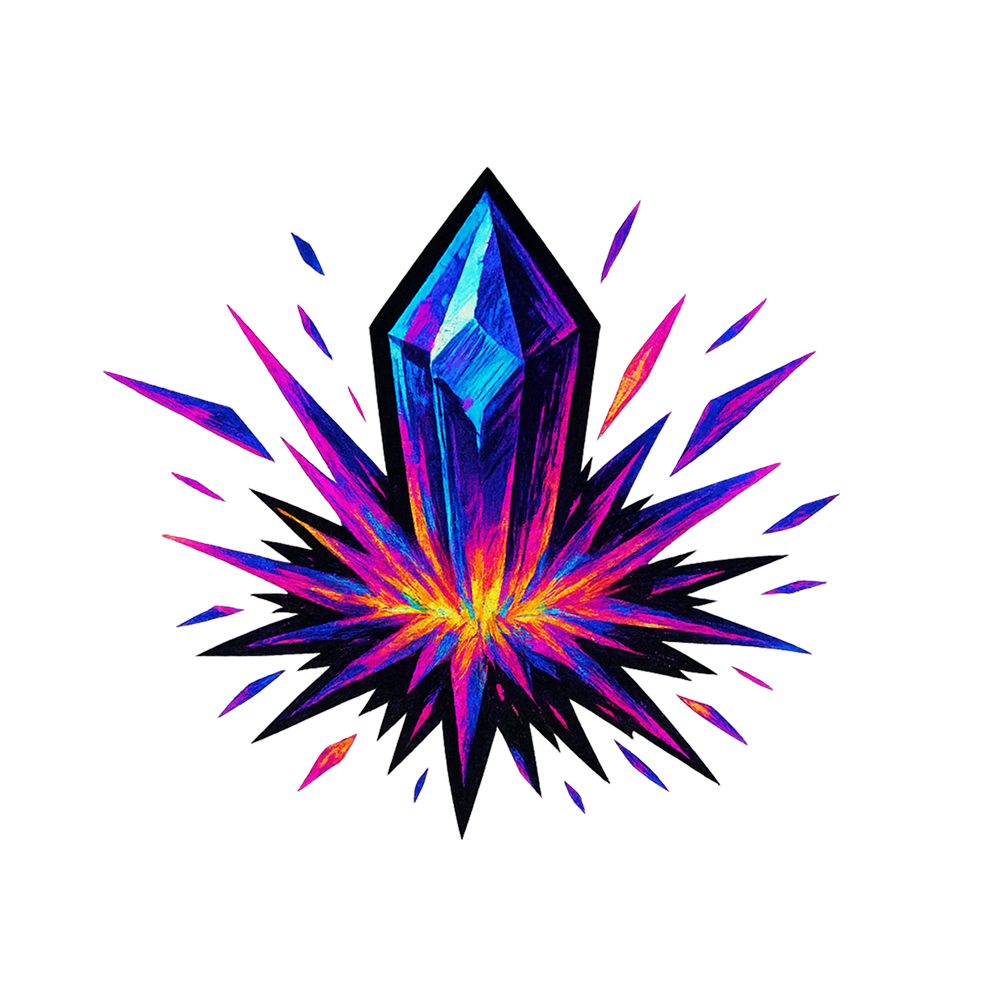
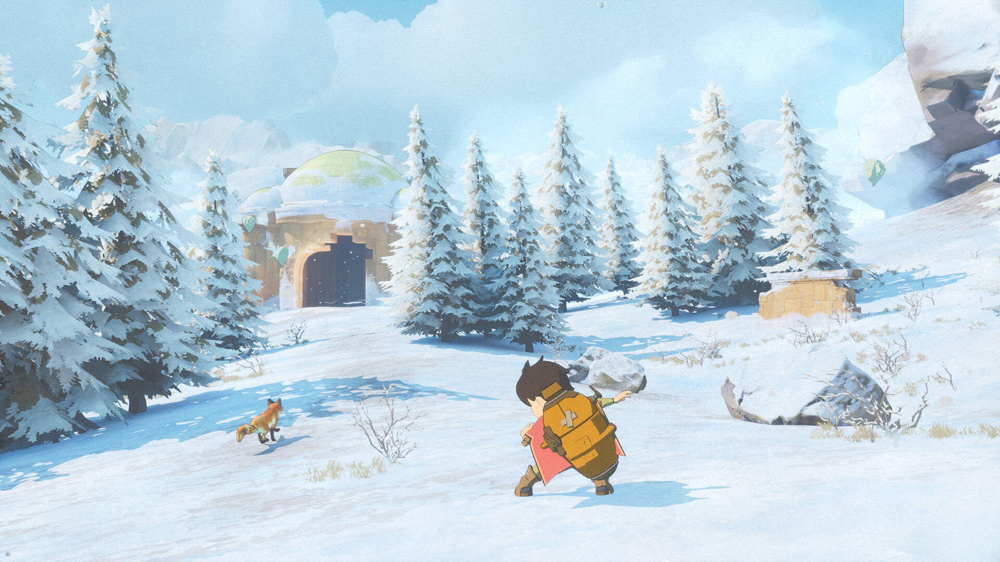
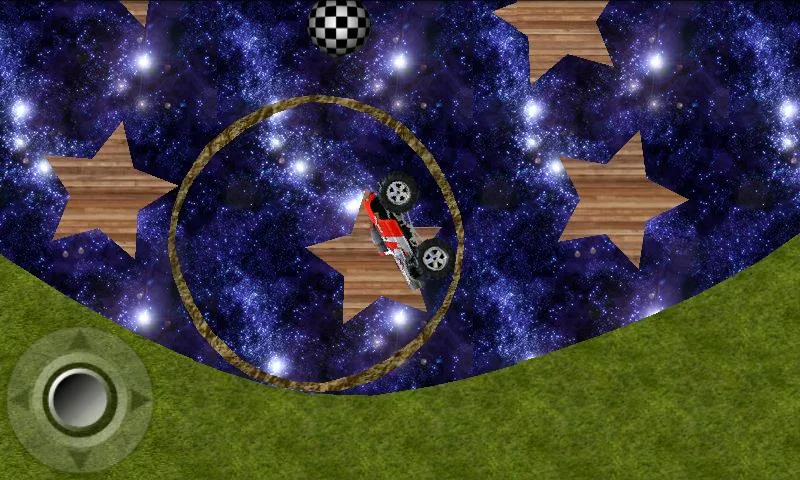

<link rel="stylesheet" href="https://cdnjs.cloudflare.com/ajax/libs/font-awesome/6.5.1/css/all.min.css">

# Broforge 

Forging new worlds.

## What we're working on now

- **Hovertron** — 2.5D physics-based hoverboarding game.

## Past games we've worked on

- **[Europa](https://store.steampowered.com/app/2214880/Europa/)** — An amazing zen sci-fi adventure game by [Novadust Entertainment](https://www.linkedin.com/company/novadust/).

  

- **Wheelz** — 2.5D physics platformer that got over 2 million downloads on Android.

  

## Team

- [Alex "Chozabu" PB](https://chozabu.net/)
- [Henry Ashley-Cooper](https://x.com/thegnhenry)

## Consulting

We provide consulting on:

- Generalist Unreal Engine
- Technical art in Unreal Engine
- Game UX design

## Contact

Ping us an email at [hello@broforge.co.uk](mailto:hello@broforge.co.uk)  

  <a href="https://x.com/thanehenry" aria-label="Twitter">
    <i class="fa-brands fa-x-twitter"></i>
  </a>
  <a href="[https://linkedin.com/in/yourname](https://www.threads.com/@henryashleycooper)" aria-label="Threads">
    <i class="fa-brands fa-threads"></i>
  </a>
    <a href="https://www.linkedin.com/company/broforge" aria-label="Threads">
    <i class="fa-brands fa-threads"></i>
  </a>

Find us on [Linkedin](https://www.linkedin.com/company/broforge).
