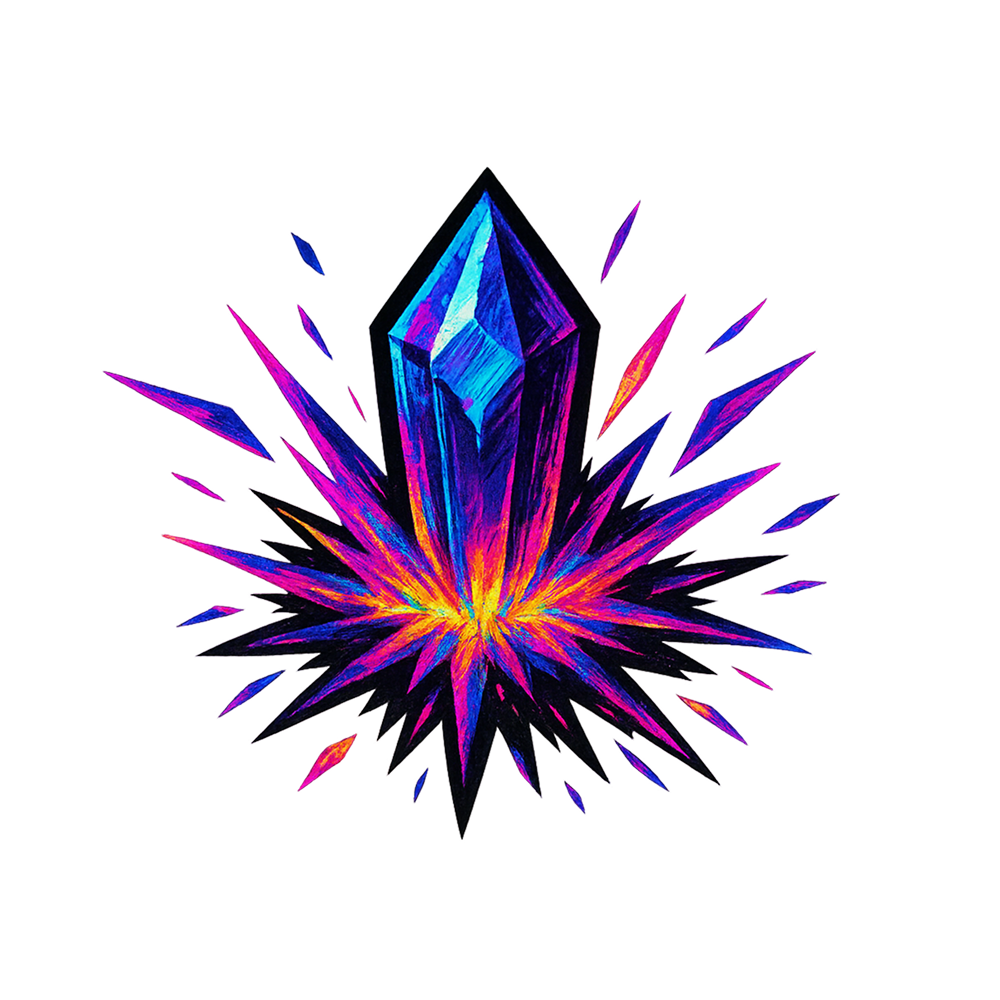
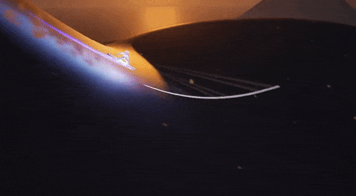

<link rel="stylesheet" href="https://cdnjs.cloudflare.com/ajax/libs/font-awesome/6.5.1/css/all.min.css">

<button class="theme-toggle" id="themeToggle" aria-label="Toggle dark mode">
  <i class="fa-solid fa-moon"></i>
</button>

  

# Broforge

Forging new worlds.

## What we're working on now

<strong><a href="https://store.steampowered.com/app/4355010/Hovertron/">Hovertron</a></strong> — 2.5D physics-based hoverboarding game.

## Past games we've worked on

<strong><a href="https://store.steampowered.com/app/2214880/Europa/">Europa</a></strong> — An amazing zen sci-fi adventure game by <a href="https://www.linkedin.com/company/novadust/">Novadust Entertainment</a>.

<strong>Wheelz</strong> — 2.5D physics platformer that got over 2 million downloads on Android.

## Team

- [Alex "Chozabu" PB](https://chozabu.net/)
- [Henry Ashley-Cooper](https://x.com/thegnhenry)

## Consulting

We provide consulting on:

- Generalist Unreal Engine
- Technical art in Unreal Engine
- Game UX design

## Contact

Ping us an email at [hello@broforge.co.uk](mailto:hello@broforge.co.uk)  

Or find us on social networks:

  <a href="https://discord.gg/DgDBXCsBBf" aria-label="Discord">
    <i class="fa-brands fa-discord fa-2x"></i>
  </a> 
  <a href="https://x.com/thanehenry" aria-label="Twitter">
    <i class="fa-brands fa-x-twitter fa-2x"></i>
  </a>
  <a href="https://www.youtube.com/@broforgestudio" aria-label="Youtube">
    <i class="fa-brands fa-youtube fa-2x"></i>
  </a>
  <a href="https://www.linkedin.com/company/broforge" aria-label="LinkedIn">
    <i class="fa-brands fa-linkedin fa-2x"></i>
  </a>  
  <a href="https://www.threads.com/@henryashleycooper" aria-label="Threads">
    <i class="fa-brands fa-threads fa-2x"></i>
  </a>
  <a href="https://www.instagram.com/henryashleycooper/" aria-label="Instagram">
    <i class="fa-brands fa-instagram fa-2x"></i>
  </a>
  <a href="https://www.facebook.com/thebroforge/" aria-label="Facebook">
    <i class="fa-brands fa-facebook fa-2x"></i>
  </a>
  <a href="https://www.reddit.com/r/Broforge/" aria-label="Reddit">
    <i class="fa-brands fa-reddit fa-2x"></i>
  </a>

